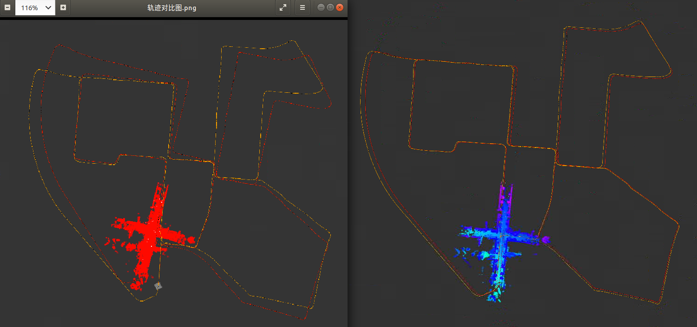

# 深蓝学院《多传感器融合定位》第二期作业

深蓝学院, 多传感器融合定位与建图, 第1节Lidar Odometry代码框架.

---

## Overview

本作业在老师给的tips版本ICP_SVD代码框架下，补充了TODO部分，实现基于ICP_SVD的激光前端里程计算法.

---

## homework

### 给出模型基于evo的精度评测结果
测评结果优于pcl的ndt和icp方法，与pcl中的ndt方法的对比图如下：

evo测评图见文件夹[点击链接进入](doc/)
